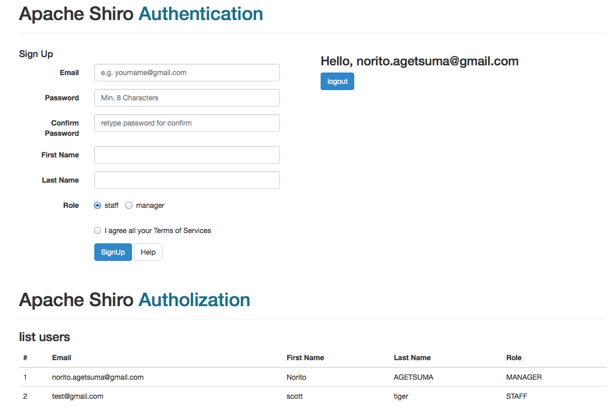

ShiroSample
===========

Apache Shiro 1.2 JDBC Realm sample.



environment
-------------
* GlassFish 4.1 (Java EE7)
* Jersey MVC
* Apache Shiro 1.2

setup
--------
1. setting your datasource

    Default datasource jndiname is java:comp/DefaultDataSource (glassfish default. connect for derby)

    * src/main/resources/META-INF/persistence.xml

    ```
    <persistence-unit name="DerbyPU" transaction-type="JTA">
        <provider>org.eclipse.persistence.jpa.PersistenceProvider</provider>
        <jta-data-source>java:comp/DefaultDataSource</jta-data-source> <= Change your DataSource jndi name
    ```

    * src/main/resources/shiro.ini

    ```
    ds.resourceName = java:comp/DefaultDataSource <= Change your DataSource jndi name
    ```

2. build
    ```
    mvn package
    ```

3. deploy
    ```
    cd glassfish4/bin
    ./asadmin start-database (if user default datasource)
    ./asadmin start-domain
    ./asadmin deploy ShoroSample.war
    ```

4. access

    [http://localhost:8080/ShiroSample](http://localhost:8080/ShiroSample)
